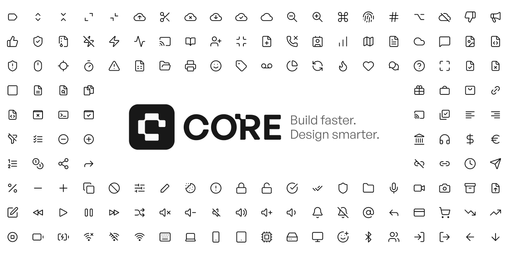

<p align="center">
  
</p>

<p align="center">
  <strong>240+ open-source, motion-ready icons for modern interfaces</strong>
</p>

<p align="center">
  <a href="https://opensource.org/licenses/MIT"></a>
  
</p>

<p align="center">
  <a href="https://coreui.design">Website</a> &nbsp;&middot;&nbsp;
  <a href="https://icons.coreui.design">Icon Platform</a> &nbsp;&middot;&nbsp;
  <a href="https://www.figma.com/community/plugin/1611582866445041500/core-icons">Figma Plugin</a>
</p>

---

## Usage

Copy any SVG directly into your project:

```html
<svg xmlns="http://www.w3.org/2000/svg" width="24" height="24" viewBox="0 0 24 24" fill="none" stroke="currentColor" stroke-width="1.5" stroke-linecap="round" stroke-linejoin="round">
  <!-- icon paths here -->
</svg>
```

All icons are 24x24, outline-style, and use `currentColor` so they inherit your text color.

Browse the [icons/](./icons) folder for the full set.

---

## License

MIT &copy; [CORE UI](https://coreui.design)
